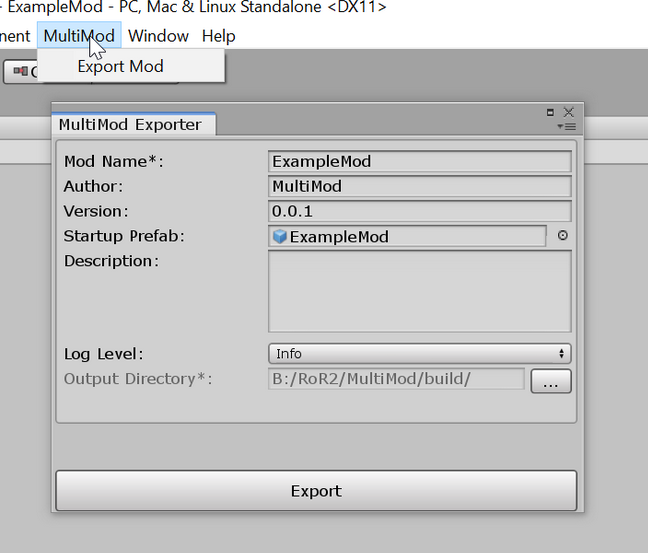
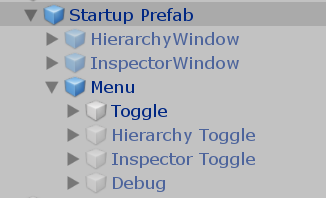
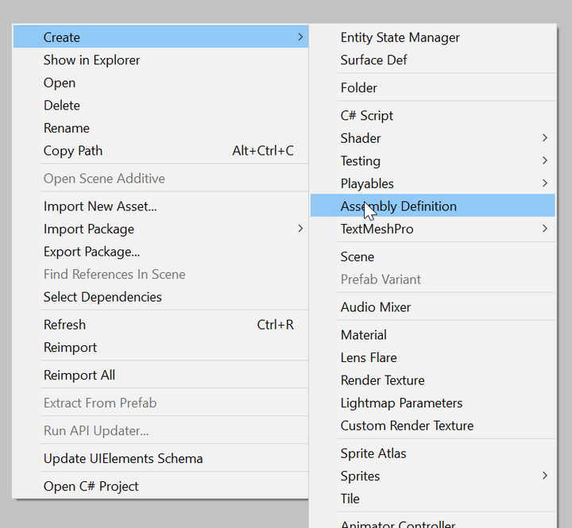
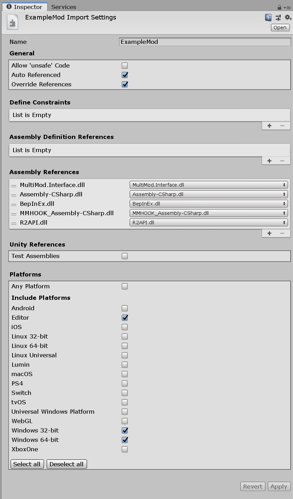
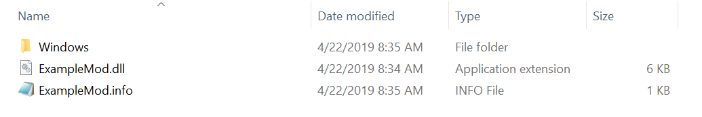
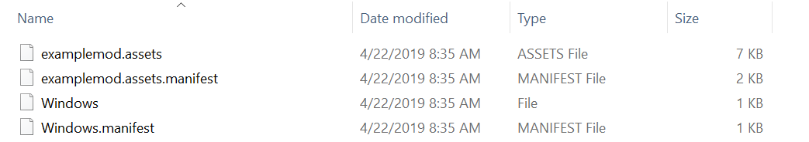

# MultiMod
Unity Assets and Scripts - *Together*!

MultiMod has two main parts:
- A **Unity Editor extension** for exporting your assetmod
- A **BepInEx plugin** to load your assetmod (and other multimod assetmods)

MultiMod assetmods also have two main parts:
- An **assembly DLL** containing your compiled C# code
- A **Unity Assetbundle** containing your prefabs, scenes and scriptable-objects

Using assetbundles with Unity modding isn't new. So what's special here?

- You don't need to write a Bepin Plugin
- You build your assetmod in Unity, using the normal workflow
- Prefabs loaded from your assetbundle will **have scripts properly attached**
- Prefabs loaded from your assetbundle will **have proper references to other prefabs**

This has a lot of advantages. If you're building UI, you can build and test it right within the Unity Editor where you can see and play with it. If you're building new prefabs, you can test them out in the Editor's play-mode, assuming your scripts don't depend on any game classes.

Even if your prefabs do depend on game classes, you may not be able to test them in play-mode, but you can still construct them in the Editor. When you put your own scripts onto your prefabs, those scripts will be properly loaded out of your assetmod DLL. Without MultiMod, you must add your scripts to GameObjects at runtime once they're loaded (or have a deeper understanding of Unity and do what MultiMod does yourself, manually).

With MultiMod, you just build your assetmod in Unity, export, and run. 

The ExampleMod is a great example of this simplicity. Check it out.

## Installation

MultiMod is a Bepin plugin, so it is installed just like any other. MultiMod also has its own `mods/` folder where assetmods go.

### Installing the Bepin Plugin

- [Install BepInEx](https://github.com/risk-of-thunder/R2Wiki/wiki/BepInEx)
- Download the latest [multimod.7z](https://github.com/risk-of-thunder/MultiMod/releases)
- Extract `multimod/` to your `BepInEx/plugins/` folder

### Installing the Exporter
- Download the latest [multimod-exporter.7z](https://github.com/risk-of-thunder/MultiMod/releases)
- Extract `Assets/` to your Unity project
- Check that a `MultiMod` menu has appeared in Unity

### Installing the ExampleMod assetmod

- Download the latest [ExampleMod.7z](https://github.com/risk-of-thunder/MultiMod/releases)
- Extract `ExampleMod` to your `BepInEx/plugins/multimod/mods/` folder
- Run the game

### Building from source

- Clone this repository somewhere
- Build `MultiMod.sln`
- Make sure VS refreshes NuGet packages. We depend on `Mono.Cecil`

The assemblies will be copied into `ExampleMod/Assets/MultiMod/` and to `build/multimod/`. The latter is a ready to use Bepin plugin distribution. So copy or symlink it to your `BepInEx/plugins/` folder to use.

To utilize the `.bat` files, you'll need to add the following executables to your path:
- `msbuild.exe`
- `Unity.exe`

# Assetmods

Assetmods are created in Unity and Visual Studio and exported with the MultiMod Exporter, a Unity Editor extension. 

## Setting up a new Unity Project

You'll need to install the MultiMod exporter. Download the latest [multimod-exporter.7z](https://github.com/risk-of-thunder/MultiMod/releases) and extract it into the root of your Unity project so that the `Assets/` folder from the archive merges with the `Assets/` folder of the project. After Unity recompiles, check that a `MultiMod` now appears in the main menu.

## The Export Window

Assetmods are exported via the `MultiMod/Export Mod` menu:

- **Mod Name** : The name of the assetmod
- **Author** : Who should get credit for the assetmod
- **Version** : What version of the assetmod is being exported
- **Startup Prefab** : Instantiated into the scene after assetmod is loaded
- **Description** : What this mod does
- **Log Level** : The log level if you use `MultiMod.Shared.LogUtility`
- **Output Directory** : Where the mod should be exported to

A lot of that is probably self-explanatory besides the **Startup Prefab**.

## The Startup Prefab

A normal Bepin plugin must define a class inheriting `BaseUnityPlugin` to be booted.

Assetmods however are booted by loading a specific prefab from your assetbundle into the scene. You can specify any prefab you want, and it can have whatever scripts on it that you'd like to start with your mod.

Your prefab can also contain child objects with their own components and children. This is useful for automatically bringing in a large structure of objects into the scene, such as a UI panel containing a number of windows.

## ContentHandler and ModBehaviour

Every assetmod has an associated `ContentHandler` instance which contains a reference to its prefabs, scenes, and the `Mod` instance itself. In order for you to receive and instance of your assetmod's `ContentHandler` you should put a `ModBehaviour` on your Startup Prefab.

`ModBehaviour` is a subclass of `MonoBehaviour` and you can use it on any of your prefabs to get an instance to the `ContentHandler` via the `ModBehavior.contentHandler` instance field.

### OnLoaded

Any script that inherits `ModBehaviour` can override the `OnLoaded(ContentHandler contentHandler)` method which is called when the assetmod has been fully loaded.

**You should not access prefabs or scenes via the `ContentHandler` before `OnLoaded` is called.**

### Scenes and Prefabs

Your assetmod's `ContentHandler` has `prefabs` and `scenes` fields which can be used to access those assets within your mod. You should use `ContentHandler.Instantiate` to instantiate them. This will ensure that any objects your assetmod creates can be properly destroyed when your assetmod is unloaded.

Currently MultiMod has no way of specifying what assets should be included in the assetmod's assetbundle. **Every asset in your project is added to your assetbundle.**

## Assetmod Assemblies

The default DLL assembly name that Unity builds all your scripts into is called `Assembly-CSharp`. The game the assetmods are being used with already contains an assembly DLL called `Assembly-CSharp`, as it too was built with Unity.

This is a problem. MultiMod can't let Unity put your assetmod's scripts into an assembly called `Assembly-CSharp` since it conflicts with the main game assembly. To solve this problem, MultiMod requires you to use **Assembly Definition** assets so that your code ends up in a different assembly. (Why yes, it would be easier if Unity just let you change the default assembly name...)

### Assembly Definition Assets

Assembly Definition assets or, **Asmdefs** for short, are a built-in Unity asset type that you can create from the asset creation menu:

Asmdef are **simple**. The easiest thing is to overthink them. Let me tell you what Asmdefs are:

    You put them in a folder. All scripts in that folder and below are compiled into a different assembly.

That's it. If the Asmdef's name is `Foobar` then you'll get `Foobar.dll` containing all the scripts below the Asmdef in the asset folder structure.

*"But what do I name my asmdef? Where do I put the scripts? etc etc"* I hear you ask.

It literally doesn't matter. You can have as many Asmdefs you'd like, and you can organize your code underneath them however you like. You need to remember one fact:

    Any scripts not captured by an Asmdef wont make it into your assetmod.

Because those scripts will ends up in `Assembly-CSharp.dll` and we can't include that in your assetmod.

#### Asmdef Settings

There are a number of settings for an Asmdef so let's take a look at some important ones. Here is the Asmdef for the ExampleMod:

- **Name** : This determines the name of the assembly DLL filename `Foo` => `Foo.dll`
- **Auto Referenced** : Should be **true**. We want Unity to load this assembly and consider it part of the project.
- **Override References** : True if you want to utilize any pre-compiled assemblies. That is, any assemblies Unity is not responsible for compiling. The ExampleMod uses quite a few. The `Assembly-CSharp.dll` is the one from the game we're modding, so we can refer to its classes in our own code. `MultiMod.Interface.dll` there is so that we can refer to `MultiMod.Interface.ModBehaviour` and `MultiMod.Interface.ContentHandler` in our code.
- **Assembly References** : Will only appear if `Override References` is true. Use this to name the precompiled-assemblies that your assetmod depends on.
- **Platforms** : Should always be exactly as shown for all assetmod Asmdefs.

## Exported Assetmod Content

Once you've exported your assetmod you should find the following content:

- **ExampleMod.dll** : The assembly containing all your scripts. You'll get one for each Asmdef you defined.
- **ExampleMod.info** : Metadata describing your assetmod
- **Windows** : Contains the assetbundle for the Windows platform (the only currently supported platform)

Inside you'll find:

## Installing Assetmods

Installing assetmods are as easy as dropping them into your `BepInEx\plugins\multimod\mods\` folder.
